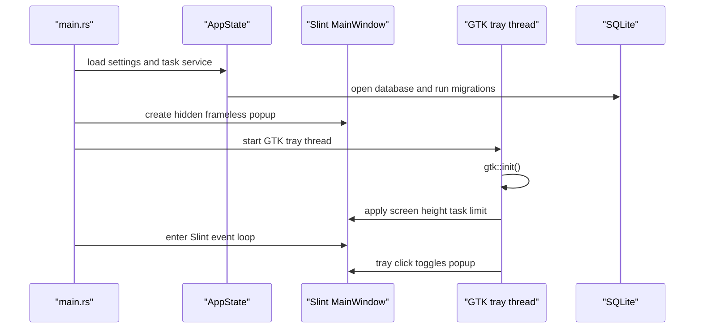

# Taskbar Todolist Desktop Technical Documentation

This document is the maintainer-facing guide for the Rust desktop application.
It complements `README.md` and `NOTICE.md`: use the README for quick setup, the
notice for user operations, and this file for architecture and implementation
details.

## Product Summary

Taskbar Todolist Desktop is a Linux-first native tray todo app. It runs in the
background, exposes a small frameless Slint popup from the desktop tray/status
area, and stores tasks locally in SQLite.

The current implementation is optimized for MATE-style notification areas while
remaining usable on other Linux sessions that expose compatible tray/status icon
support.

## Runtime Flow



## Module Map

- `src/main.rs`: bootstraps tracing, app state, UI, tray, startup notification,
  and the Slint event loop.
- `src/app/state.rs`: builds shared app state from settings and task service.
- `src/app/settings.rs`: loads, normalizes, saves YAML settings, and computes
  the intelligent visible-task limit.
- `src/app/tray.rs`: owns GTK tray/status icon integration and popup anchoring.
- `src/app/notifications.rs`: sends startup notifications through `notify-send`.
- `src/app/windows.rs`: exposes app quit behavior for Slint and GTK callbacks.
- `src/ui/mod.rs`: defines the Slint popup and connects callbacks to services.
- `src/tasks/model.rs`: defines task and status types.
- `src/tasks/service.rs`: logs and exposes task operations to the UI layer.
- `src/tasks/repository.rs`: persists tasks in SQLite through SQLx.
- `src/tasks/migrations.rs`: embeds SQL migrations.
- `migrations/`: stores SQLite migration files.
- `packaging/`: stores desktop-entry, icon, and AppImage support files.

## Settings

Settings live in `taskbar-todolist.settings.yaml`.

Current schema:

```yaml
language: fr
visible_tasks: 3
```

Rules:

- `language` accepts `fr` or `en`.
- `visible_tasks` must be a complete integer.
- Missing or malformed YAML is rewritten with defaults.
- Out-of-range values are normalized before being saved.

### Intelligent Visible Task Limit

The user can choose how many tasks are visible before scrolling. The upper bound
is not fixed: once GTK initializes, the tray layer reads the current screen
height and computes:

```text
visible task limit = (screen height - popup top - 12px bottom gap - 116px header/footer - 94px settings panel) / 42px
```

`popup top` is the real y-position where the popup opens below the desktop panel.
`12px` leaves a small bottom safety gap. `116px` is the fixed space around the
list: top input, bottom action row, padding, and gaps. `94px` is reserved for
the settings panel so opening settings does not push the popup below the screen.
`42px` is the effective Slint task-row pitch: 34px row height plus layout
spacing. If GTK cannot report the screen height, the app uses the fallback
maximum of `20`.

Implementation anchors:

- `TASK_ROW_HEIGHT_PX` in `src/app/settings.rs`
- `POPUP_HEADER_FOOTER_HEIGHT_PX` in `src/app/settings.rs`
- `SETTINGS_PANEL_HEIGHT_PX` in `src/app/settings.rs`
- `POPUP_SCREEN_BOTTOM_GAP_PX` in `src/app/settings.rs`
- `intelligent_visible_task_limit()` in `src/app/settings.rs`
- `runtime_visible_task_limit()` in `src/app/tray.rs`
- `apply_visible_task_limit()` in `src/ui/mod.rs`

## Task Storage

The SQLite database is `taskbar-todolist.sqlite`.

Installed/package launches run from:

```text
${XDG_DATA_HOME:-$HOME/.local/share}/taskbar-todolist-desktop/
```

Development launches from `cargo run` use the current working directory.

Task rows include:

- `id`
- `text`
- `status`
- `created_at`
- `updated_at`
- `deleted_at`

Deletes are soft deletes. Active task queries filter `deleted_at IS NULL` and
sort `todo` rows before `done` rows.

## Tray And Popup Behavior

The tray uses GTK status icon behavior because it is reliable in MATE-style
notification areas. The popup is a Slint window with:

- no frame;
- always-on-top behavior;
- stable positioning below the tray icon;
- tray-click toggle behavior.

Positioning prefers GTK icon geometry over raw pointer coordinates. This keeps
the popup stable even when the user clicks different pixels inside the same tray
icon.

## UI Behavior

The popup supports:

- creating a task from the top input with `Enter`;
- checking a task as done;
- moving done tasks to the end automatically;
- striking only the completed text, not the whole row;
- editing a task by double-clicking its text;
- saving edits with `Enter`;
- deleting with a Lucide trash icon;
- opening settings with a Lucide settings icon;
- scrolling once the active task list exceeds the visible row count.

## Build Commands

Development:

```bash
./run_dev.sh
```

Release build:

```bash
./run_prod.sh
```

Watch mode:

```bash
./run_watch.sh
```

Tests:

```bash
cargo test
```

Documentation site:

```bash
make docs
```

Generated Rust documentation:

```text
target/doc/taskbar_todolist_desktop/index.html
```

## Packaging

Build both release artifact types:

```bash
make clean-dist package
```

Expected outputs:

```text
dist/taskbar-todolist-desktop_0.1.1_amd64.deb
dist/taskbar-todolist-desktop-0.1.1-x86_64.AppImage
```

The AppImage target requires `appimagetool` in `PATH`, or:

```bash
APPIMAGETOOL=/path/to/appimagetool make package-appimage
```

## Validation Checklist

Before publishing or pushing a release-oriented change:

1. Run `cargo fmt --check`.
2. Run `cargo test`.
3. Run `make docs`.
4. Run `make clean-dist package`.
5. Confirm both `.deb` and `.AppImage` exist in `dist/`.
6. Smoke-test `./run_dev.sh` on a desktop with a visible tray/status area.

## Troubleshooting

### No tray icon

Confirm that the desktop session exposes a notification area or AppIndicator
compatible tray. MATE needs the notification area applet in the panel.

### Popup moves when clicking the tray icon

Run trace logging:

```bash
RUST_LOG=taskbar_todolist_desktop=trace ./run_dev.sh
```

Inspect `status icon geometry`, `toggle_panel_at`, and `showing slint panel`
events. Geometry-based anchoring should keep the popup stable for clicks inside
the same icon.

### Settings are rewritten

The app rewrites settings when the YAML is missing, invalid, or outside the
runtime bounds. Check the current screen-height-derived limit in trace logs:

```text
computed intelligent visible task limit
```

### AppImage build fails

Install or provide `appimagetool`. The Makefile does not download it
automatically because release packaging should be deterministic.
