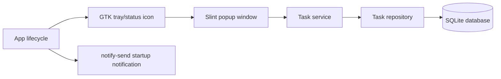

# Taskbar Todolist Desktop

Taskbar Todolist Desktop is a Linux-first native tray todo app written in Rust.
It keeps a compact todo list available from the desktop notification area so
small tasks can be added, checked, edited, and deleted without opening a full
productivity application.

## What It Does

- Runs in the background with a tray/status icon.
- Opens a small frameless popup from the tray icon.
- Adds a task from the top input when `Enter` is pressed.
- Shows active tasks in a scrollable compact list.
- Marks tasks as done with a checkbox.
- Moves done tasks to the end of the list automatically.
- Strikes through only the completed task text.
- Edits a task by double-clicking its text, then pressing `Enter`.
- Deletes a task with the trash button.
- Persists tasks locally in SQLite.
- Sends a startup notification, with MATE-aware wording when MATE is detected.
- Opens a settings panel from a Lucide settings icon.
- Saves language and visible-task-count preferences to YAML.
- Computes the maximum visible task count from the current screen height.

## Current Platform Scope

The current release targets Linux desktop sessions with a tray/status area.
The app has been developed around a MATE-style notification area and GTK status
icon behavior.

Expected runtime support:

- Linux x86_64
- GTK 3
- Ayatana AppIndicator or compatible tray/status support
- Desktop notification support through `notify-send`
- SQLite runtime library

The project intentionally does not use Tauri, WebKit/WebGTK, Vite, pnpm, a
browser UI runtime, or a Node sidecar.

## Download

Release v0.1.0 provides:

- Debian package: `taskbar-todolist-desktop_0.1.0_amd64.deb`
- AppImage: `taskbar-todolist-desktop-0.1.0-x86_64.AppImage`

Release page:

```text
https://github.com/taskbar-todolist/taskbar-todolist-desktop/releases/tag/v0.1.0
```

## Install From Release

### Debian Package

```bash
sudo apt install ./taskbar-todolist-desktop_0.1.0_amd64.deb
```

Then launch it from the Applications menu as `Taskbar Todolist`, or run:

```bash
taskbar-todolist-desktop
```

### AppImage

```bash
chmod +x taskbar-todolist-desktop-0.1.0-x86_64.AppImage
./taskbar-todolist-desktop-0.1.0-x86_64.AppImage
```

If the AppImage starts but no tray icon appears, check that your desktop session
has a visible notification area or AppIndicator-compatible tray.

## Install From Source

Install the native build dependencies first. Debian/Ubuntu package names:

```bash
sudo apt install build-essential pkg-config libgtk-3-dev libayatana-appindicator3-dev libsqlite3-dev libnotify-bin
```

Build and install for the current user:

```bash
make install
```

This installs:

- binary: `~/.local/share/taskbar-todolist-desktop/taskbar-todolist-desktop`
- launcher: `~/.local/bin/taskbar-todolist-desktop`
- desktop entry: `~/.local/share/applications/taskbar-todolist-desktop.desktop`

Uninstall:

```bash
make uninstall
```

## Development

Run in development mode:

```bash
./run_dev.sh
```

Run a release build locally:

```bash
./run_prod.sh
```

Run in watch mode:

```bash
cargo install cargo-watch
./run_watch.sh
```

Show full trace logs:

```bash
RUST_LOG=taskbar_todolist_desktop=trace ./run_dev.sh
```

Generate local web documentation for the Rust code:

```bash
make docs
```

Then open:

```text
target/doc/taskbar_todolist_desktop/index.html
```

## Packaging

Build release packages:

```bash
make clean-dist package
```

Outputs:

- `dist/taskbar-todolist-desktop_<version>_amd64.deb`
- `dist/taskbar-todolist-desktop-<version>-x86_64.AppImage`

The AppImage target requires `appimagetool` in `PATH`, or an explicit path:

```bash
APPIMAGETOOL=/path/to/appimagetool make package-appimage
```

The `docs` target uses Rust's built-in `rustdoc` generator. No external web
documentation generator is required for API/module documentation.

## Data Storage

The app stores tasks in a local SQLite database named:

```text
taskbar-todolist.sqlite
```

The app stores UI preferences in a YAML file named:

```text
taskbar-todolist.settings.yaml
```

When launched through the installed launcher or release package, the database is
and settings file are created under:

```text
${XDG_DATA_HOME:-$HOME/.local/share}/taskbar-todolist-desktop/
```

When launched directly with `cargo run`, the database is created in the current
working directory.

Task records contain:

- `id`
- `text`
- `status` (`todo` or `done`)
- `created_at`
- `updated_at`
- `deleted_at`

Delete actions are soft deletes: deleted tasks receive a `deleted_at` timestamp
and are filtered out of the active list.

Settings are created automatically when missing. If the YAML exists but cannot
be parsed or does not follow the expected schema, it is rewritten with safe
defaults.

Current settings schema:

```yaml
language: fr
visible_tasks: 3
```

Supported languages are `fr` and `en`. `visible_tasks` controls how many task
rows are visible before scrolling and therefore changes the popup height. The
upper bound is calculated at runtime as `screen height / 42px`, where `42px` is
the effective task-row pitch used by the Slint list. Before GTK reports the
screen height, the app falls back to a conservative maximum of `20`.

In the settings panel, this value is typed directly by the user and saved with
`Enter`; valid values are from `1` to the detected runtime limit. Invalid
non-integer input is rejected and the previous valid value is restored.

## Architecture



Main module layout:

- `src/main.rs` starts tracing, app state, UI, tray, notifications, and the Slint event loop.
- `src/app/` owns lifecycle, app state, tray integration, notifications, tracing, and app quit behavior.
- `src/app/settings.rs` owns YAML normalization and the intelligent visible-task limit.
- `src/ui/` owns the Slint popup UI and UI-to-service callbacks.
- `src/tasks/` owns task model, service, repository, and migrations.
- `migrations/` contains SQLx SQLite migrations.
- `packaging/` contains AppImage and desktop-entry packaging assets.

## Validation

Run the test suite:

```bash
cargo test
```

Run compiler checks:

```bash
cargo check
```

Run formatting checks:

```bash
cargo fmt --check
```

Current test coverage includes:

- task creation, update, soft delete, and sorting;
- 500-task repository performance smoke coverage;
- tray popup positioning and stable icon anchoring;
- startup notification arguments and MATE wording;
- UI model loading of active tasks.
- settings YAML normalization and runtime visible-task limit calculations.

## Troubleshooting

### No Tray Icon

Make sure the desktop has tray/status icon support enabled. On GNOME, this
usually requires an AppIndicator/KStatusNotifier extension. On MATE, the panel
must include a notification area.

### App Starts But No Notification

Install `notify-send`:

```bash
sudo apt install libnotify-bin
```

### AppImage Fails On A Minimal System

The current AppImage packages the application layout but still expects common
desktop libraries from the host system. Install the runtime libraries:

```bash
sudo apt install libgtk-3-0 libayatana-appindicator3-1 libsqlite3-0 libnotify-bin
```

### Debug Tray Positioning Or UI Events

Run with trace logs:

```bash
RUST_LOG=taskbar_todolist_desktop=trace ./run_dev.sh
```

The tray code logs click coordinates, GTK icon geometry, popup anchors, and
show/hide decisions.
